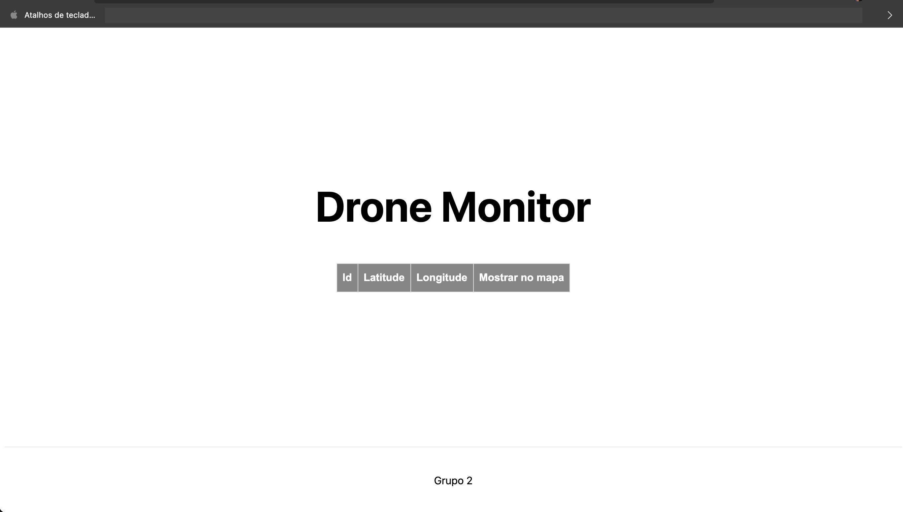
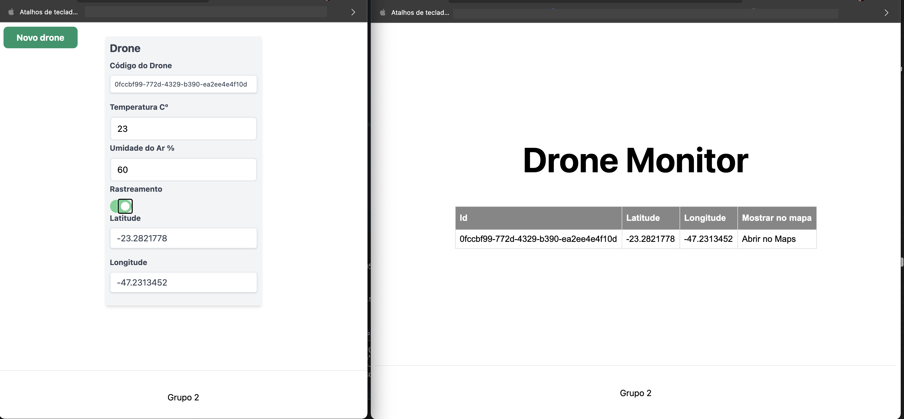
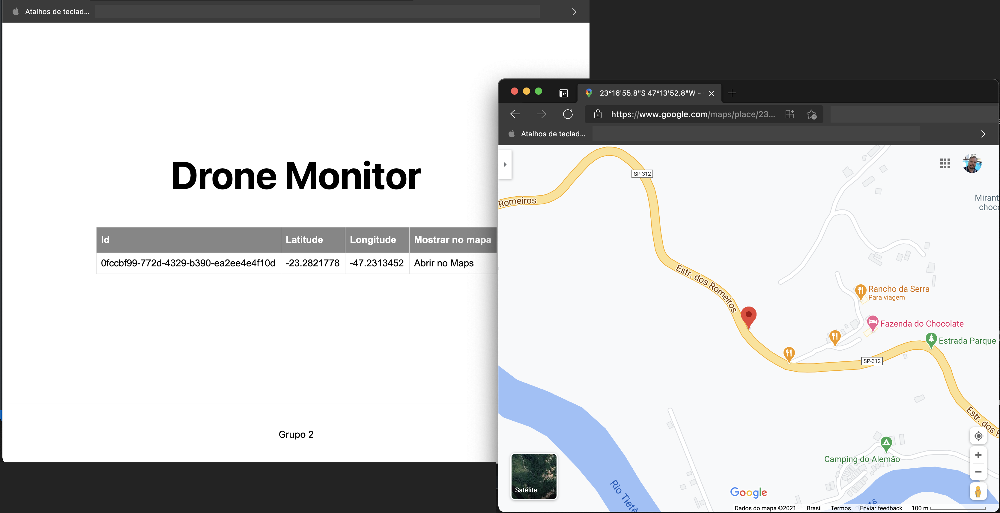

# Simulação do monitoramento de um drone


## Descrição
<p>
Acompanha a fila do kafka e insere a informações para monitoração do drone ratreável
</p>

## Rode antes o projeto de criação dos drones
<p>
Antes de iniciar com esse projeto, é necessário primeiro configurar a aplicação que cria os drones para serem monitorados. Segue abaixo o link para o repositório com as instruções para configurá-lo:
</P>

- [kafka-producer-front-system](https://github.com/cmpsmarcio/kafka-producer-front-system)

## Iniciando
<p>Você precisará ter o Node instalado. Segue o link abaixo caso precise:</p>

- [Nodejs](https://nodejs.org/en/download/)

<p>1º passo - Faça um clone do projeto</p>

<p>2º passo - Rode o comando abaixo para que o Node instale as dependencias do projeto</p>

```bash
~ npm install
```

<p>3º passo - Para buildar o projeto, rode o comando abaixo</p>

```bash
~ npm run build
```

<p>4º passo - Por fim, rode o comando abaixo para rodar a aplicação</p>

```bash
~ npm start
```

<p>Uma indicação sobre a url e a porta ira aparecer, copie a url e cole no navergador para abrir a aplicação</p>

```bash
~ ready - started server on 0.0.0.0:3005, url: http://localhost:3005
```

<p>Imagem da página</p>
<h1 align="center">
  
</h1>

<p>Acesse a aplicação para criaçao do drone em http://localhost:3000, crie um drone e habilite o rastreamento. Em alguns segundos, irá aparecer a informação no monitor</p>
<h1 align="center">
  
</h1>


<p>Ao clicar em Abrir no Maps, será aberta uma nova aba com a localização indicada</p>
<h1 align="center">
  
</h1>

This is a [Next.js](https://nextjs.org/) project bootstrapped with [`create-next-app`](https://github.com/vercel/next.js/tree/canary/packages/create-next-app).